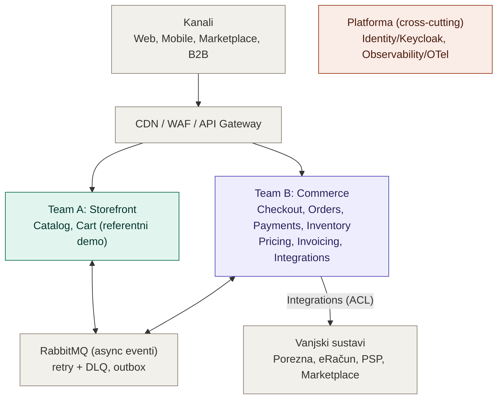
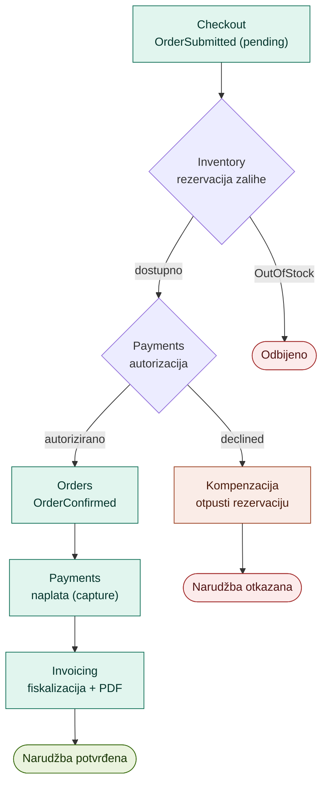

# Online maloprodajna platforma, high-level arhitektura

- **Autor:** Slaven Robić
- **Datum:** 6.6.2026.
- **Kontekst:** stručni zadatak (Engineering Manager)

Platforma za globalnog klijenta, milijuni korisnika dnevno, dva cross-funkcionalna tima. Ovaj dokument daje high-level pogled; implementacijski detalji referentnog Cart servisa su u [`CART_SPEC.md`](./CART_SPEC.md), a obrazloženja ključnih odluka u [`ADR.md`](./ADR.md).

## Sažetak

Manji broj servisa podijeljenih po domeni i poravnatih s timovima. Hibridna komunikacija: REST za sinkroni zahtjev-odgovor, RabbitMQ eventi za međudomenske tokove. Database-per-service (PostgreSQL), outbox + DLQ za pouzdane poruke, saga s jeftinim kompenzacijama za tok kupnje. Keycloak (OIDC) za identitet, OpenTelemetry za observabilnost, trunk-based isporuka s pipelineom po servisu. Fiskalizacija i eRačun su odvojeni, zakonski kritični tokovi. Napredne obrasce (saga, Kafka) uvodim tek kad ih konkretan tok zahtijeva.

## 1. Kontekst i zahtjevi

Prodajni kanali, svaki s drukčijim profilom prometa i integracije:

| Kanal | Karakteristike |
|---|---|
| Web shop | Najveći volumen, špičasti promet, SEO i performanse |
| Mobilne aplikacije | Visok promet, traži stabilne i verzionirane API-je |
| Marketplace | Sinkronizacija kataloga/zaliha/narudžbi (Amazon, eMAG) |
| B2B | Manje klijenata, veći volumen po transakciji, posebni cjenici |

Tri ključna nefunkcionalna zahtjeva vode gotovo svaku odluku:

- **Skalabilnost / visok promet:** stateless servisi, horizontalno skaliranje, cache, async obrada.
- **Sigurne transakcije i zaštita podataka:** OAuth2/OIDC, enkripcija u tranzitu i mirovanju, idempotentnost, audit.
- **Real-time obrada:** event-driven arhitektura (broker, event tokovi).

Gdje je koji zahtjev iz zadatka pokriven:

| Zahtjev | Sekcija |
|---|---|
| Skalabilnost i visok promet | 5 |
| Sigurne transakcije i zaštita podataka | 6, 3.4 |
| Real-time obrada | 3.2, 3.3 |
| Više kanala (web, mobile, marketplace, B2B) | 3, 7 |
| Dva tima | 2 |
| Arhitekturni pogled + komunikacija | 3, 4 |
| Odabir tehnologija | 3.3, ADR.md |
| Sigurnost i autentifikacija | 6 |
| Ključne komponente i odgovornosti | 4 |
| Vanjski servisi (Porezna) | 7 |
| Monitoring i alerting (healthcheck) | 8 |
| Plan isporuke (CI/CD, branching) | 9 |
| Minimalna implementacija (Cart API) | CART_SPEC.md |

Globalni kontekst: MVP je jedna regija + CDN za statiku; regionalni read modeli, data residency i multi-region DR uvode se po potrebi.

## 2. Timovi i granice servisa

Granice servisa prate granice timova i domena. Podjela je po **domeni**, ne po kanalu, da timovi ne diraju isti kod.

| | Team A: Storefront | Team B: Commerce |
|---|---|---|
| Domene | Catalog, Search, Cart | Checkout, Orders, Payments, Inventory, Pricing, Invoicing, Integrations |
| Promet | Visok, čitanja dominiraju | Transakcijski, integracijski |

Referentni Cart servis pripada Team A.

- Timovi komuniciraju kroz kontrakte (OpenAPI, sheme evenata), ne kroz zajednički kod.
- Standardiziraju se **šavovi** (kontrakti, format greške RFC 7807, correlation ID, healthcheck, auth, telemetrija), ne unutrašnjost servisa.
- Cross-cutting sposobnosti (Identity, Observability) imaju jasnog vlasnika (platforma), uz inner-source doprinose.
- Kad tim treba promjenu u tuđoj domeni: PR na repozitorij vlasnika (inner-source), ne blokada.

## 3. Arhitektura

### 3.1 Pregled

Kanali ulaze kroz gateway na servise podijeljene po domenama. Servisi komuniciraju asinkrono preko RabbitMQ; svaki ima vlastiti store. Identity i observabilnost su cross-cutting.

### 3.2 Stil i komunikacija

- Manji broj servisa po domeni, ne monolit (kočio bi nezavisnu isporuku i skaliranje) ni fino-zrnati mikroservisi (preskupo za dva tima). Dalje cijepanje samo uz konkretan pokretač.
- **Database-per-service:** nijedan servis ne čita tuđu bazu; razmjena ide kroz evente i kontrakte.
- **Sinkrono (sjever-jug):** contract-first REST kroz gateway, gdje je prirodno zahtjev-odgovor (npr. Cart čita Catalog po ID-u).
- **Asinkrono (istok-zapad):** domenski eventi preko RabbitMQ (`OrderSubmitted`, `InventoryReserved`, `PaymentAuthorized`). Publisher ne zna tko konzumira. Daje decoupling, otpornost i real-time propagaciju.
- **CQRS read modeli:** Elasticsearch za pretragu kataloga, Redis za vruće podatke (košarica, zalihe). Konzistentnost po kontekstu: eventual za katalog/search, jaka za košaricu i naplatu.

### 3.3 Tehnologije

| Aspekt | Izbor |
|---|---|
| Runtime | .NET 10 (LTS), C# |
| Web | ASP.NET Core Minimal API |
| Async | RabbitMQ |
| Write baza | PostgreSQL + EF Core 10 |
| Cache | Redis |
| Search | Elasticsearch |
| Dokumenti | Object storage (S3-kompatibilan) |
| Identitet | Keycloak (OIDC/OAuth2) |
| Orkestracija | Docker + Kubernetes |
| Observabilnost | OpenTelemetry + Prometheus + Grafana |

Portabilno i cloud-agnostično; managed servise uzimam gdje smanjuju operativni rizik.

### 3.4 Pouzdanost poruka

- **At-least-once** isporuka (durable queues, publisher confirms, manual ack), pa konzumenti moraju biti idempotentni (dedup po message ID-u / inbox tablica).
- **Retry s backoffom**, nakon N pokušaja poruka ide u **dead-letter (DLQ)**; rast DLQ-a je signal za alert.
- **Outbox pattern** rješava dual-write: event se upisuje u istoj transakciji kao promjena stanja, zaseban relay ga objavljuje.
- RabbitMQ nije log; "replay" znači DLQ replay ili outbox replay. Kafka tek ako zatreba arbitraran povijesni replay.

### 3.5 Konzistentnost i korelacija

- Atomičnost je lokalna (ACID unutar servisa). Kroz servise nema distribuirane transakcije.
- **Saga** povezuje lokalne transakcije eventima, uz kompenzacijske akcije kad korak padne. Choreography za jednostavne tokove, orchestration za složene.
- **Correlation ID** kreira se na gatewayu i putuje sinkrono (W3C `traceparent`) i asinkrono (metapodaci poruke). Correlation ID prati tok, message ID deduplicira, to su dvije različite stvari.

Tok kupnje i kompenzacije:

Zaliha se rezervira prije autorizacije, naplata (capture) ide tek nakon potvrde. Time su kompenzacije jeftine: otpuštanje rezervacije umjesto povrata novca.

## 4. Ključne komponente

| Servis | Tim | Odgovornost | Store |
|---|---|---|---|
| Catalog | A | Proizvodi, kategorije, pretraga | PostgreSQL, Elasticsearch |
| Cart (demo) | A | Košarica, snapshot cijene | PostgreSQL (demo), Redis (prod) |
| Checkout | B | Košarica u narudžbu, re-validacija cijena | PostgreSQL |
| Orders | B | Životni ciklus narudžbe, koordinacija sage | PostgreSQL |
| Payments | B | Autorizacija i naplata, povrati | PostgreSQL |
| Inventory | B | Zalihe, rezervacija, otpuštanje | PostgreSQL, Redis |
| Pricing & Promotions | B | Cijene, popusti, B2B cjenici | PostgreSQL, Redis |
| Invoicing | B | Računi, fiskalizacija, arhiva PDF | PostgreSQL, Object store |
| Integrations | B | Anti-corruption layer prema vanjskim sustavima | PostgreSQL |

Cart drži snapshot cijene radi korisničkog iskustva; Checkout uvijek ponovno validira cijenu i dostupnost prije potvrde.

Glavni eventi (verzionirani ugovori): `ProductUpdated`, `OrderSubmitted`, `InventoryReserved` / `OutOfStock`, `PaymentAuthorized` / `PaymentDeclined`, `OrderConfirmed`, `PaymentCaptured`, `InvoiceRequested`, `InvoiceGenerated`.

Cross-cutting (vlasnik: platforma): API gateway (routing, rate limiting, TLS, prva linija auth), Identity (Keycloak), RabbitMQ, Observability, Object storage.

### 4.1 Back-office / interni admin (izvan opsega)

Realna platforma ima back-office (upravljanje katalogom, cijenama, narudžbama). Zadatak navodi customer-facing kanale, pa je admin izvan opsega, ali ga navodim radi potpunosti:

- Nije nova domena ni servis, nego dodatni interni konzumer iza gatewaya (vlastiti BFF) nad postojećim servisima (Catalog, Pricing, Inventory, Orders).
- Autorizacija kroz `internal_admin` rolu i admin scopeove.
- Cart demo zato katalog samo čita.

## 5. Skaliranje

- Stateless servisi + Kubernetes HPA; skaliranje po servisu (Catalog/Cart odvojeno od Orders/Payments).
- Cache: Redis (hot podaci), CDN (statika), Elasticsearch (search read model).
- Async obrada: teški poslovi (PDF, fiskalizacija, marketplace sync, notifikacije) izvan request toka; broker apsorbira špice.
- Baza: read replicas, connection pooling, particioniranje kad volumen traži.
- Špice (Black Friday): proaktivni autoscaling, rate limiting (token bucket na gatewayu, distribuiran preko Redisa), graceful degradation (žrtvuj ne-kritično da kritični put preživi), backpressure.

Cart demo pokazuje stateless servis i optimistic concurrency (`xmin`, `409`); ostalo je infrastrukturno.

## 6. Sigurnost i autentifikacija

- Identitet: Keycloak preko OIDC/OAuth2 ("buy, not build"). Standard je fiksan, provider zamjenjiv.
- Dva toka: Authorization Code + PKCE (korisnici), Client Credentials (B2B M2M i servis-servis).
- **Zero-trust:** svaki servis je resource server i sam validira JWT (potpis, `exp`, `aud`, scope), i za interni promet; servis-servis dodatno mTLS.
- **Scope vs vlasništvo:** scope određuje pristup endpointu, role + domenska provjera pristup podatku. Npr. `cart:write` pušta poziv, ali servis provjerava da košarica pripada subjektu iz tokena.
- Izolacija: kupci po `sub`/`customer_id`, B2B po `b2b_account_id`.
- **Valjanost i opoziv:** kratki access tokeni (5-15 min) + refresh rotacija. JWT je snapshot ovlasti, pa se za kritične opozive (blokiran račun) provjerava živo stanje ili radi introspekcija, ne samo oslanjanje na token.
- Zaštita podataka: TLS svugdje, enkripcija u mirovanju, secrets u vaultu, GDPR (brisanje/anonimizacija, minimizacija), audit s correlation ID-em.

### 6.1 Rubni sloj (BFF) i vlasništvo košarice

Domenski servisi ne znaju za sesije i frontende; to drži rubni sloj. Iza gatewaya po jedan BFF (Backend for Frontend) po kanalu agregira pozive i skraja odgovor.

- **Web BFF (obavezan):** cookie-session prema browseru, JWT prema servisima. Browser ne drži JWT (XSS).
- **Mobile BFF (opcionalan):** mobitel nosi JWT end-to-end; BFF služi agregaciji, može se dodati kasnije.
- **Vlasništvo košarice:** Cart ostaje anoniman (`OwnerId = null`, guest) ili vezan uz `sub` (logiran). Za logiranog usera `OwnerId` je dijeljeni izvor istine, pa je ista košarica dostupna na više uređaja; konkurentne izmjene rješava optimistic concurrency, spajanje guest košarice na loginu ide postojećim merge pravilom.

## 7. Vanjske integracije

Sve vanjske integracije idu kroz **Integrations servis** kao anti-corruption layer (adapter po vanjskom sustavu). Domenski servisi vide samo interni model.

**Fiskalizacija B2C** (Invoicing, radi svjesnosti):

- ZKI se generira lokalno digitalnim certifikatom, pa ne ovisi o dostupnosti Porezne.
- JIR se dohvaća asinkrono; ako Porezna nije dostupna, račun se izda i fiskalizira naknadno u zakonskom roku.
- Trajni red + retry + idempotentnost (isti račun se ne fiskalizira dvaput) + alert na približavanje roku.

**eRačun B2B/B2G:** odvojen tok od fiskalizacije, strukturirani XML preko informacijskog posrednika, KPD šifre. Zaseban adapter.

**Marketplace / PSP:** async preko adaptera, idempotentnost na webhookove, poštivanje vanjskih rate limita.

Otpornost na ispade: circuit breaker, timeouts, retry + DLQ, trajni redovi za zakonski obvezne tokove. Vanjski sustav se tretira kao normalno-nedostupan, ne iznimka.

## 8. Monitoring i alerting

- Standard: OpenTelemetry (metrike, logovi, traceovi), vizualizacija Grafana. Backend zamjenjiv jer sve ide preko OTela.
- Strukturirani logovi nose correlation ID; distribuirani tracing pokazuje gdje je vrijeme potrošeno i gdje lanac puca.
- **Healthcheck:** liveness (proces živ, inače restart) i readiness (spreman za promet, npr. baza dostupna, inače izbaci iz routinga bez restarta). Cart demo to pokazuje.
- **SLO/SLI** (npr. p99 latencija košarice), alert na simptome (probijanje SLO-a), ne na svaki skok metrike. Error budget vodi odluke.
- Specifično pratimo: rast DLQ-a, zaostajanje outbox relaya, red nefiskaliziranih računa, zaglavljene sage, stanje circuit breakera.

Svaki tim je vlasnik observabilnosti svojih servisa na zajedničkoj platformi.

## 9. Plan isporuke

- **Pipeline po servisu:** build, test (unit + integration s Testcontainers), security scan (SCA/SAST, image), package (Docker), deploy. Testovi i scan su gate, ne preporuka.
- **Branching:** trunk-based, kratke grane, feature flagovi za nedovršeno, obavezan PR review + zeleni CI prije merge-a.
- **Deploy:** blue-green ili canary uz praćenje metrika i automatski rollback.
- **Migracije:** unatrag-kompatibilne, expand-contract, kroz CI (EF Core migracije). Deploy koda i sheme ne moraju biti atomarni.
- **Contract testing** (npr. Pact) između timova osigurava da promjena kontrakta ne razbije drugu stranu.
- Odvojena okruženja (dev/staging/prod), isti artefakt, konfiguracija izvan koda, tajne u vaultu. U nižim okruženjima anonimizirani podaci.

Cart repo pokazuje osnove: commitovi koji prate razvoj, testovi kao gate, verzionirane migracije, Docker image kao artefakt.

## 10. Fazna isporuka

- **Faza 0, walking skeleton:** jedan servis + baza + gateway + CI/CD + observabilnost kroz produkcijski pipeline. Dokazuje da cijeli lanac radi.
- **Faza 1, jezgra kupnje:** Catalog, Cart, Checkout, Orders, Payments, Inventory; web kanal; prvi async eventi; fiskalizacija B2C.
- **Faza 2, kanali i integracije:** mobile, marketplace, B2B, eRačun, Invoicing, Pricing; saga; puni CQRS.
- **Faza 3, skaliranje:** autoscaling tuning, replike/particioniranje, analytics, Kafka ako se pojavi streaming/replay pokretač.

Glavni rizici i mitigacije:

| Rizik | Mitigacija |
|---|---|
| Ispad Porezne (fiskalizacija) | Lokalni ZKI, trajni red, retry, idempotentnost, alert na rok |
| Eventual consistency zbunjuje | Jasni event kontrakti, observabilnost, correlation ID |
| Distribuirana složenost | Manji broj servisa, modularna disciplina |
| Dual-write / izgubljeni eventi | Outbox + DLQ |
| Špice preopterete sustav | Autoscaling, rate limiting, graceful degradation |

## 11. Arhitektonske odluke

Ključne odluke (stil komunikacije, granularnost, baza, broker, identitet, pohrana dokumenata, observability backend) zapisane su u [`ADR.md`](./ADR.md) u formatu kontekst, alternative, odluka, posljedice.
