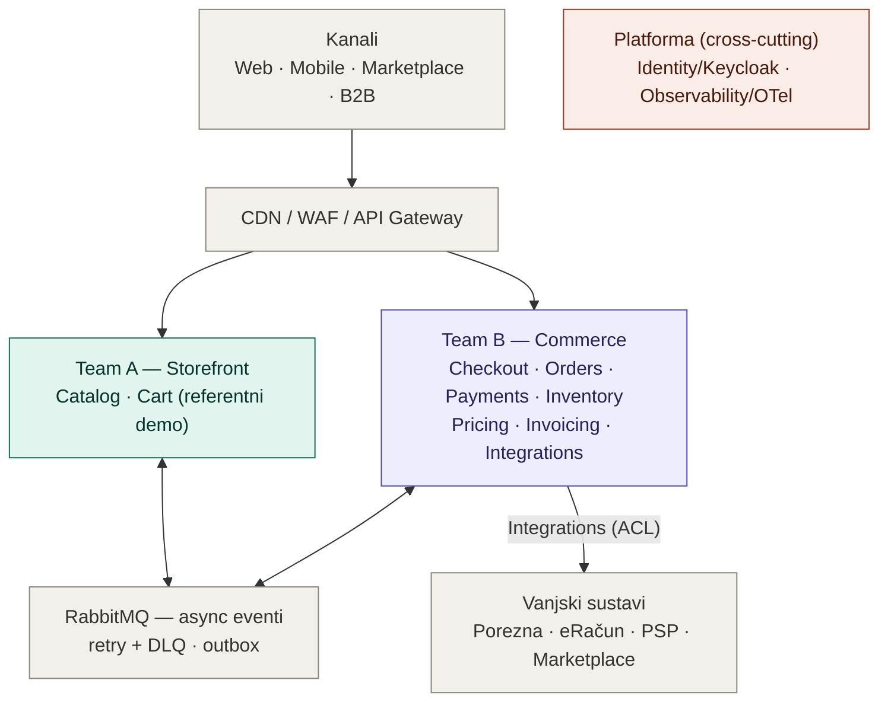
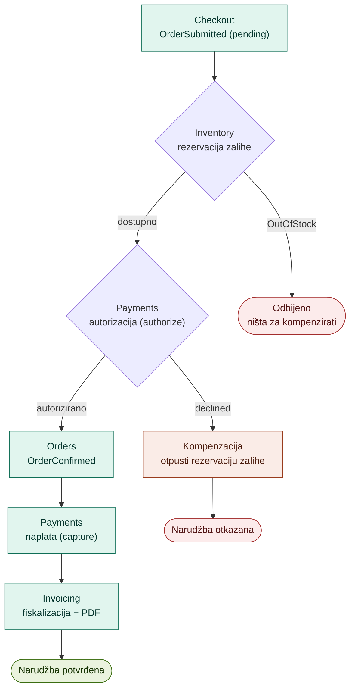

# Online maloprodajna platforma — High-level dizajn i strategija implementacije

**Autor:** Slaven Robić

**Datum:** 2026-07-05

**Kontekst:** Stručni zadatak — Engineering Manager

**Status dokumenta:** Verzija za tehnički zadatak

Ovaj dokument opisuje viziju high-level arhitekture i strategiju implementacije online maloprodajne platforme za globalnog klijenta s milijunima korisnika dnevno. Implementacijski detalji referentnog servisa (Cart API) opisani su zasebno u [`CART_SPEC.md`](./CART_SPEC.md).

---

## Sadržaj

1. [Kontekst i ključni zahtjevi](#1-kontekst-i-ključni-zahtjevi)
2. [Topologija timova i vlasništvo (Team topology & ownership)](#2-topologija-timova-i-vlasništvo)
3. [Arhitekturni pogled sustava](#3-arhitekturni-pogled-sustava)
4. [Ključne komponente i odgovornosti](#4-ključne-komponente-i-odgovornosti)
5. [Strategija skaliranja](#5-strategija-skaliranja)
6. [Sigurnost i autentifikacija](#6-sigurnost-i-autentifikacija)
7. [Integracija s vanjskim servisima](#7-integracija-s-vanjskim-servisima)
8. [Monitoring i alerting](#8-monitoring-i-alerting)
9. [Plan isporuke koda (CI/CD i branching)](#9-plan-isporuke-koda)
10. [Plan isporuke i evolucija](#10-plan-isporuke-i-evolucija)
11. [Dodatak: Architecture Decision Records (ADR)](#11-architecture-decision-records)

---

## Executive summary

Predložena arhitektura koristi manji broj domenski podijeljenih servisa poravnatih s dva tima (Storefront / Commerce), hibridnu komunikaciju (REST za zahtjev-odgovor, asinkroni eventi za međudomenske tokove), database-per-service s PostgreSQL-om, outbox pattern i DLQ za pouzdane evente, sagu s jeftinim kompenzacijama (authorize/capture razdvajanje u naplati), OIDC (Keycloak) za identitet, OpenTelemetry za observabilnost i trunk-based delivery sa zasebnim pipelineom po servisu. Fiskalizacija (B2C) i eRačun (B2B) tretirani su kao odvojeni, zakonski kritični tokovi s trajnim redovima i idempotentnošću. Početna implementacija demonstrira **Cart API** kao high-traffic bounded context. Arhitektura je portabilna, a napredni obrasci uvode se tek kad ih konkretan tok zatraži.

---

## 1. Kontekst i ključni zahtjevi

### 1.1 Poslovni kontekst

Razvija se online maloprodajna platforma za klijenta koji posluje na **globalnom tržištu** s **milijunima korisnika dnevno**. Platforma omogućuje prodaju proizvoda kroz više prodajnih kanala, pri čemu svaki kanal ima različite obrasce prometa, zahtjeve integracije i sigurnosne profile:

| Kanal | Karakteristike |
|---|---|
| **Web shop** | Najveći volumen, špičasti promet (kampanje, blagdani), SEO i performanse ključni |
| **Mobilne aplikacije** | Visok udio prometa, zahtijeva stabilne i verzionirane API-je |
| **Marketplace integracije** | Sinkronizacija kataloga/zaliha/narudžbi s vanjskim platformama (npr. Amazon, eMAG) |
| **B2B integracije** | Manji broj klijenata, veći volumen po transakciji, specifični uvjeti i cjenici |

### 1.2 Ključni nefunkcionalni zahtjevi (NFR)

Tri zahtjeva klijenta dižem na razinu vodećih principa jer oblikuju gotovo svaku arhitektonsku odluku u nastavku:

- **Skalabilnost i podrška za visok promet** — sustav mora elastično podnositi milijune korisnika dnevno i špičaste navale (flash sale, Black Friday) bez degradacije. → Vodi nas prema *stateless* servisima, horizontalnom skaliranju, cacheanju i asinkronoj obradi.
- **Sigurne transakcije i zaštita podataka** — financijske transakcije i osobni podaci (GDPR) zahtijevaju enkripciju, robusnu autentifikaciju/autorizaciju i auditabilnost. → Vodi nas prema OAuth2/OIDC, enkripciji u tranzitu i mirovanju, te principu najmanjih privilegija.
- **Real-time obrada podataka** — zalihe, cijene, status narudžbe i sinkronizacija kanala moraju biti ažurni gotovo u stvarnom vremenu. → Vodi nas prema *event-driven* arhitekturi (message broker, event streaming).

### 1.3 Organizacijski kontekst

Na sustavu rade dva cross-funkcionalna tima. To nije sporedan detalj — broj i struktura timova izravno oblikuju granice sustava (Sekcija 2). Arhitekturu sam postavio tako da dva tima mogu raditi paralelno, uz minimalnu koordinaciju i nezavisnu isporuku.

### 1.4 Vodeći principi dizajna

Sve odluke u dokumentu slijede ovih nekoliko principa:

1. **Granice slijede timove i domene** — modularnost koja omogućuje nezavisan rad i deploy.
2. **Stateless gdje god je moguće** — stanje izvan aplikacijskih instanci (cache, baza, broker) radi horizontalnog skaliranja.
3. **Async by default za međudomensku komunikaciju** — otpornost i razdvajanje (decoupling) umjesto čvrstih sinkronih lanaca.
4. **Sigurnost ugrađena, ne dograđena** — auth, enkripcija i audit su dio dizajna od početka.
5. **Sve je mjerljivo** — bez observabilnosti nema skaliranja ni pouzdanosti.

### 1.5 Mapiranje zahtjeva na rješenje

Pregled gdje je svaki zahtjev iz zadatka adresiran u ovom dokumentu:

| Zahtjev iz zadatka | Gdje je riješen |
|---|---|
| Skalabilnost i visok promet (milijuni korisnika) | §5 (skaliranje: stateless, cache, async, autoscaling, špice) |
| Sigurne transakcije i zaštita podataka | §6 (auth, enkripcija, GDPR); §3.6/3.7 (idempotentnost, saga) |
| Real-time obrada podataka | §3.3 (event-driven), §3.6 (async tokovi) |
| Više prodajnih kanala (web, mobile, marketplace, B2B) | §3 (gateway + kanali), §7 (marketplace/B2B integracije) |
| Dva cross-funkcionalna tima | §2 (topologija, vlasništvo, ispomoć, protok znanja) |
| Arhitekturni pogled + komunikacija komponenti | §3 (dijagram, stil, komunikacija), §4 (komponente) |
| Odabir glavnih tehnologija | §3.4 (tech stack), §11 + `ADR.md` (obrazloženja) |
| Sigurnost i autentifikacija | §6 |
| Definicija ključnih komponenti i odgovornosti | §4 |
| Integracija s vanjskim servisima (Porezna uprava) | §7 (fiskalizacija B2C + eRačun B2B, otpornost) |
| Monitoring i alerting (healthcheck) | §8 (observabilnost, SLO, healthcheck, alerting) |
| Plan isporuke koda (CI/CD, branching) | §9 (pipeline, trunk-based, deploy, migracije) |
| Minimalna implementacija (Cart Web API + baza) | `CART_SPEC.md` + referentni repo |

### 1.6 Pretpostavke za globalni kontekst

Zadatak navodi globalno tržište; radne pretpostavke za opseg ovog dizajna:

- **MVP:** jedna primarna regija + globalni CDN za statiku i keširane odgovore; skaliranje unutar regije (§5).
- **Evolucija po potrebi:** regionalni read modeli i inventory/fulfillment, data residency zahtjevi po tržištu, multi-region DR.
- **Domenske posljedice globalnosti** (ovdje samo naznačene): više valuta i cjenika po tržištu (Pricing servis), lokalizacija sadržaja, regionalni porezni režimi (fiskalizacija u §7 pokriva HR kao primjer), različiti payment provideri po tržištu (iza Integrations ACL-a).

---

## 2. Topologija timova i vlasništvo

Arhitektura se ne crta u vakuumu. Prema Conwayevom zakonu, sustav na kraju preslika komunikacijsku strukturu organizacije koja ga gradi — pa granice servisa namjerno postavljam tako da se poklapaju s granicama timova. U suprotnom se loše granice pojave same od sebe: timovi koji se stalno gaze po istom kodu i na kraju distribuirani monolit.

### 2.1 Podjela po domeni (ne po kanalu)

Dva tima dijelimo prema **poslovnoj domeni**, a ne prema prodajnom kanalu. Podjela po kanalu (npr. "tim za web" i "tim za marketplace") značila bi da oba tima diraju iste domene (oba trebaju katalog, oba trebaju checkout) → maksimalna međuovisnost. Podjela po domeni minimizira preklapanje i jasno dodjeljuje vlasništvo.

| | **Team A — Storefront / Shopping** | **Team B — Commerce & Integrations** |
|---|---|---|
| **Misija** | Put kupca do kupnje (customer-facing) | Transakcijska jezgra i veza s vanjskim svijetom |
| **Vlasništvo (domene)** | Catalog, Search, Cart | Checkout, Orders, Payments, Inventory, Pricing, vanjske integracije |
| **Tipičan promet** | Visok, čitanja dominiraju, špičasto | Transakcijski kritičan, integracijski |
| **Primjeri zahtjeva** | Brzina kataloga, dostupnost košarice | Konzistentnost naplate, fiskalizacija, marketplace/B2B sinkronizacija |

Team A je manji po broju servisa, ali nosi najveći promet i customer-facing kompleksnost. Checkout sam stavio u Commerce tim jer najviše ovisi o Orders/Payments/Inventory — tako najkritičniji tok (checkout → naplata → zaliha) ostaje unutar jednog tima, bez međutimskog uskog grla. Ako se kasnije pokaže potreba, checkout se može razdvojiti na customer-facing fasadu (Team A) i commerce orkestrator (Team B).

> Referentna implementacija u ovom zadatku (**Cart API**) pripada domeni **Team-a A** i predstavlja vertikalni rez kroz tu domenu.

### 2.2 Integracijski šav između timova

Timovi komuniciraju preko ugovora (kontrakata), a ne preko zajedničkog koda:

- **Asinkroni eventi** (message broker / event streaming) za međudomenske događaje — npr. `OrderSubmitted`, `InventoryReserved`, `PaymentAuthorized`. Tim koji proizvodi event ne mora znati tko ga troši.
- **Contract-first API-ji** (OpenAPI) za sinkrone pozive — kontrakt je dogovoren i verzioniran, a implementacija iza njega je privatna stvar tima.

Posljedica: Team A može mijenjati interni model košarice bez utjecaja na Team B, sve dok poštuje dogovoreni kontrakt i emitirane evente.

### 2.3 Zajedničke (platformske) sposobnosti

Klasična zamka kod dva tima: zajedničke stvari (auth, observability, CI/CD šabloni, dijeljene biblioteke) postanu "ničija zemlja". Rješenje:

- Definiramo **platformske sposobnosti** s eksplicitnim vlasnikom (jedan tim ih drži kao "platform capability", ili se primjenjuje **inner-source** model s jasnim maintainerima i PR-review pravilima).
- Cilj: zajedničko se konzumira, ali uvijek ima odgovornu osobu/tim za održavanje i evoluciju.

### 2.4 Mehanizmi koordinacije

Za odluke koje dotiču oba tima koristimo lagane, ali jasne mehanizme:

- **Architecture guild / sync** — kratki redoviti dogovor o presjecima i zajedničkim standardima.
- **ADR (Architecture Decision Records)** — svaka odluka koja utječe na oba tima je zapisana i obrazložena (vidi [Sekciju 11](#11-architecture-decision-records)).
- **Verzioniranje kontrakata** — promjene API-ja i event-shema idu kroz pravila kompatibilnosti (backward-compatible po defaultu).

### 2.5 Standardi i autonomija

Cilj je naći ravnotežu: previše standardizacije guši autonomiju timova (a autonomija je razlog zašto smo uopće podijelili rad na dva tima), premalo standardizacije vodi u dva nespojiva svijeta u kojima se nitko ne snalazi u tuđem kodu. Rješenje je standardizirati **šavove i zajedničke aspekte**, a ne **unutrašnjost servisa**.

**Standardizira se (obavezno — to su dodirne točke):**

- **Vanjski kontrakti** — REST konvencije, OpenAPI specifikacije, verzioniranje, jedinstven format greške (RFC 7807 Problem Details), sheme evenata.
- **Cross-cutting concerns** — format logova, correlation/trace ID, healthcheck endpointi, mehanizam autentifikacije, metrike i telemetrija (isporučeno kroz dijeljene biblioteke).
- **Operativni standardi** — pakiranje (Docker), isporuka (CI/CD šabloni), konfiguracija.

**Ne standardizira se (autonomija vlasničkog tima):**

- **Interna struktura servisa** — slojevi, raspored direktorija, interni naming, izbor internih biblioteka i obrazaca (npr. koristi li tim MediatR ili ne). Dok god servis poštuje vanjski kontrakt i operativne standarde, njegova je unutrašnjost stvar tima koji ga vlasnički drži.

**Mehanizmi provedbe** (standard mora živjeti u alatima i kodu, ne samo u dokumentu koji nitko ne čita):

- **Service template** — novi servis se skela iz zajedničkog šablona (`dotnet new` custom template) koji već sadrži logging, healthcheck, telemetriju, Dockerfile i CI pipeline. Standard se nasljeđuje besplatno, umjesto da se naknadno nameće.
- **Dijeljene biblioteke (NuGet)** — cross-cutting funkcionalnost kao platformska sposobnost s jasnim vlasnikom (vidi 2.3).
- **Engineering guidelines + PR review** — mjesto gdje se standard održava u praksi.
- **ADR** — za standarde koji dotiču oba tima.

### 2.6 Međutimska ispomoć

Stroge granice vlasništva ne smiju značiti da tim koji zapne ostaje blokiran dok čeka drugi tim. Definiramo modele ispomoći koji ne narušavaju vlasništvo:

- **Inner source (preferirano).** Tim kojem treba promjena u tuđoj domeni **otvara Pull Request na repozitoriju vlasničkog tima**; vlasnik ga reviewira i merge-a. Vlasništvo i kontrola ostaju kod vlasnika, ali tražitelj nije blokiran. Ovaj model funkcionira upravo zato što su konvencije standardizirane (2.5) — tuđi se kod može razumjeti.
- **Privremena rotacija / embedding.** Developer iz jednog tima privremeno radi s drugim timom (kritičan rok, prijenos znanja). Uz operativnu korist, ovo razvija **T-shaped inženjere** i buduće Tech Leadove.
- **Guild za zajedničke aspekte.** Ljudi iz oba tima povremeno surađuju na dijeljenim bibliotekama i alatima koji nemaju jednog prirodnog vlasnika.

**Uloga Engineering Managera** ovdje je ključna i konkretna:

- **Uklanjanje blokera** — organiziranje ispomoći umjesto da preopterećeni tim tone.
- **Balansiranje opterećenja** — preusmjeravanje kapaciteta između timova prema potrebi.
- **Zaštita od trajnog odljeva** — ispomoć je vremenski omeđena i dogovorena, nikad tihi permanentni teret jednom timu.

### 2.7 Protok znanja i prezentiranje rada

Bez aktivnog dijeljenja znanja dva tima postaju dva otoka koja se "iznenade" na integraciji. Protok znanja je ugrađen u ritam rada kroz tri vrste kanala:

- **Živi demo.** Zajednički **sprint review / demo** (oba tima pozvana) i periodični **demo day / show & tell** gdje se pokazuje stvarni isporučeni rad, ne slideovi. Za netrivijalne teme — **interni tech talk / meetup** s Q&A.
- **Sinkroni dogovor o presjecima.** **Architecture guild** (vidi 2.4) — mjesto gdje se odluke koje dotiču oba tima prezentiraju i usuglase *prije* nego postanu gotov fakt.
- **Pisani (asinkroni) trag.** **ADR-ovi** (odluka + kontekst), **README i živa dokumentacija** uz servis, te **changelog / release notes** uz svaku novu verziju kontrakta — da drugi tim odmah zna što se promijenilo, bez potrebe da je bio na sastanku.

Poticanje ovakvog dijeljenja (demo, tech talkovi, radionice) vidim kao izravan dio uloge Engineering Managera.

Ukratko: arhitektura je postavljena tako da dva tima rade paralelno uz minimalnu koordinaciju i nezavisnu isporuku. Sve što slijedi proizlazi iz te odluke.

---

## 3. Arhitekturni pogled sustava

### 3.1 Pregled

Sustav je organiziran u jasne slojeve: prodajni kanali ulaze kroz jedinstveni **API gateway**, koji usmjerava promet na servise podijeljene prema domenama i vlasništvu timova (Team A — Storefront, Team B — Commerce). Servisi međusobno komuniciraju **asinkrono preko RabbitMQ** message brokera, a svaki servis ima **vlastito spremište podataka** (database-per-service). Identitet i observabilnost izdvojeni su kao **cross-cutting platformske sposobnosti** koje koriste sve domene.

Dijagram je sažet: vanjski sustavi i observabilnost prikazani su shematski, a detaljni tokovi (fiskalizacija, monitoring) razrađeni su u Sekcijama 7 i 8. Veze servis→baza nisu crtane jer svaki servis ima vlastiti store; dijeljenje ide isključivo preko evenata.

### 3.2 Stil arhitekture

Odabrao sam **manji broj servisa poravnatih s domenama i vlasništvom timova** — ne jedan monolit, ali ni fino zrnatu mrežu mikroservisa. Razlozi za izbjegavanje obje krajnosti:

- **Zašto ne jedan monolit:** kosio bi se s nezavisnom isporukom iz Sekcije 2 (dva tima morala bi koordinirati svaki deploy) i onemogućio bi nezavisno skaliranje vrućih putanja — Catalog i Cart trpe čitanja u špici, dok su Orders i Payments transakcijski; monolit bi ih prisilio da se skaliraju zajedno.
- **Zašto ne fino zrnati mikroservisi:** dva tima ne mogu operativno održavati 20-ak servisa; prerana fragmentacija donosi distribuiranu složenost (mrežna latencija, eventual consistency posvuda, teško debugiranje) bez odgovarajuće koristi i lako sklizne u "distribuirani monolit".
- **Zašto baš ovako:** granica servisa = granica domene = granica vlasništva tima (Conway, Sekcija 2). Unutar svakog servisa vrijedi **modularna disciplina** (čisti slojevi, bounded context). Dodatno cijepanje bih radio tek kad postoji konkretan razlog: neovisno skaliranje, jasno vlasništvo ili različit release ritam — ne zbog mode.

**Database-per-service.** Svaki servis je isključivi vlasnik svoje sheme i podataka; nijedan servis ne čita tuđu bazu izravno. Time se izbjegava skriveno spajanje kroz zajedničku bazu (najčešći uzrok "distribuiranog monolita") i čuva nezavisna deployabilnost. Razmjena podataka ide preko evenata i kontrakata.

### 3.3 Komunikacija među komponentama

Pristup je hibridan — nisam išao na "sve je event". Sinkrono se koristi tamo gdje je prirodno zahtjev-odgovor (npr. Cart čita Catalog get-by-id), a asinkroni eventi samo tamo gdje decoupling nosi stvarnu vrijednost (međudomenski tokovi, npr. Order → Payment → Inventory). Sustav razlikuje dvije osi komunikacije:

**Sjever-jug (sinkrono, izvana prema unutra).** Kanali ulaze kroz API gateway, koji radi routing, rate limiting, TLS terminaciju i prvu liniju autentifikacije. Gdje je sinkroni servis-servis poziv nužan, koristi se **contract-first REST** (OpenAPI), uz verzioniranje kontrakata (Sekcija 2.4).

**Istok-zapad (asinkrono, među servisima).** Glavni obrazac integracije su **domenski eventi preko RabbitMQ** (`OrderSubmitted`, `InventoryReserved`, `PaymentAuthorized`, `ProductUpdated`). Servis koji objavljuje event ne mora znati tko ga konzumira (pub/sub preko topic exchangeova). Time se postiže:

- **Razdvajanje (decoupling)** — Team A i Team B ne blokiraju jedan drugoga; mijenjaju interni model bez utjecaja na druge dok poštuju shemu eventa.
- **Otpornost** — spor ili nedostupan servis ne ruši lanac sinkrono; poruke čekaju u redu.
- **Real-time** — eventi se propagiraju gotovo u stvarnom vremenu, što pokriva klijentski zahtjev za real-time obradom.

**CQRS read modeli.** Pisanje ide u primarni store (PostgreSQL), a read-optimirane projekcije pune se iz istog event toka: **Elasticsearch** za pretraživanje kataloga, **Redis** za vruće podatke (košarica, zalihe). Konzistentnost se bira po kontekstu — *eventual* je prihvatljiva za katalog/search (indeks smije kasniti stotinjak ms), a *jaka* je obavezna za košaricu i naplatu.

### 3.4 Izbor tehnologija

Arhitektura je **portabilna** — temelji se na otvorenim tehnologijama i kontejnerizaciji, i ne veže domenski dizajn uz jednog providera. Za produkciju bih pragmatično razmotrio managed servise (baza, broker, observability) tamo gdje smanjuju operativni rizik — portabilnost je vrijednost, ne dogma (vidi ADR-004, ADR-007).

| Aspekt | Tehnologija | Obrazloženje |
|---|---|---|
| Runtime / jezik | **.NET 10 (LTS), C# 14** | Tri godine podrške; značajni performansni dobici i niža potrošnja memorije (uz milijune korisnika → manji infra trošak); moderni jezični alati |
| Web sloj | ASP.NET Core (Minimal API) | Lagan, brz, OpenAPI-friendly |
| Sinkrona integracija | REST + OpenAPI (contract-first) | Standardni, verzionirani kontrakti među timovima |
| Asinkrona integracija | **RabbitMQ** | Pouzdan async pub/sub uz nizak operativni teret |
| Write baza | **PostgreSQL** + EF Core 10 | Dokazana za visok promet; database-per-service |
| Cache / hot data | **Redis** | Košarica, sesije, vruće zalihe |
| Search read model | **Elasticsearch** | Full-text i faceted pretraga kataloga (CQRS) |
| Dokumenti / blob | **Object storage** (S3-kompatibilan) | PDF računi i datoteke izvan baze (Sekcija 7) |
| Identitet | **Keycloak** (OIDC/OAuth2) | Dokazani IdP; standardni protokol → provider zamjenjiv |
| Gateway | API gateway / ingress (npr. YARP ili ingress controller) | Jedinstvena ulazna točka |
| Orkestracija | **Docker + Kubernetes** | Horizontalno skaliranje, cloud-agnostično |
| Observabilnost | **OpenTelemetry + Prometheus + Grafana** | Metrike, logovi, traceovi (Sekcija 8) |
| Lokalni dev | **.NET Aspire** | Orkestracija lokalnog razvoja + telemetrija "out of the box" |

Za runtime sam odabrao aktualni .NET LTS — klijent traži stabilnu, dugoročno podržanu platformu, a ekosustav je zreo za Web API, observabilnost, container deployment i enterprise integracije.

### 3.5 Cross-cutting platformske sposobnosti

**Identity (Keycloak)** i **Observability** izdvojeni su iz domenskih timova jer ih koriste *sve* domene. Ne pripadaju nijednom timu pojedinačno nego se vode kao platformske sposobnosti s jasnim vlasnikom (Sekcija 2.3). Detalji sigurnosti i autentifikacije razrađeni su u Sekciji 6, a observabilnost u Sekciji 8.

### 3.6 Pouzdanost poruka (delivery, retry, dead-letter, replay)

Async komunikacija zahtijeva eksplicitnu strategiju za neuspjehe — inače "izgubljena" ili "zaglavljena" poruka tiho razbije konzistentnost.

- **Delivery garancija: at-least-once.** RabbitMQ uz manual ack, durable queues, persistent messages i publisher confirms jamči da poruka neće nestati, ali može stići više puta. Posljedica: konzumenti moraju biti idempotentni (dedup preko idempotency ključa / inbox tablice obrađenih poruka).
- **Retry s backoffom.** Tranzijentni neuspjeh (npr. baza nakratko nedostupna) → ograničeni retry s odgodom (delayed-retry queue / TTL), ne trenutni beskonačni requeue. Nakon N pokušaja → dead-letter.
- **Dead-letter (DLX/DLQ).** Poruke koje su odbijene, istekle (TTL) ili premašile broj pokušaja idu na dead-letter exchange → dead-letter queue — "parkiralište" koje sprječava da poison message (poruka koja uvijek pada) beskonačno blokira queue. Rast DLQ-a je signal za alerting (Sekcija 8).
- **Outbox pattern.** Servis ne može atomarno i upisati u svoju bazu i objaviti event (dual-write problem). Event se upisuje u outbox tablicu u istoj DB transakciji kao promjena stanja; zaseban relay ga objavljuje. Objava je time zajamčena, a outbox je usput trajni zapis iz kojeg se može re-objaviti (replay).
- **Replay — i iskren trade-off RabbitMQ vs. Kafka.** RabbitMQ **nije log**: jednom potrošena i potvrđena poruka je nestala, pa nema besplatnog "vrti povijest od početka" kao kod Kafke. "Replay" ovdje znači **DLQ replay** (nakon ispravka buga vrati dead-lettered poruke u glavni queue) ili **outbox replay** (re-objava iz trajnog zapisa). Ako *arbitraran povijesni replay / event sourcing* postane tvrd zahtjev (rebuild read modela od nule, analytics nad cijelom poviješću), to je pokretač za uvođenje Kafke — dosljedno s "tehnologija slijedi stvarni pokretač" (Sekcija 3.2).

Kafku ne bih uvodio unaprijed — arbitraran povijesni replay je pokretač za nju, kad se pojavi.

### 3.7 Distribuirana konzistentnost i korelacija

Uz database-per-service, konzistentnost se ne postiže jednom velikom transakcijom nego lokalnim transakcijama + koordinacijom. Jedinstveni korelacijski ID provlači se kroz cijeli tok da bi se sve moglo pratiti i da bi koraci bili sigurni kod ponovljene isporuke.

- **Atomičnost je lokalna.** Svaki servis radi u svojoj lokalnoj ACID transakciji (uklj. upis u outbox u istoj transakciji, Sekcija 3.6). Unutar granice servisa imamo punu atomičnost i konzistentnost.
- **Nema distribuirane ACID transakcije.** Kroz više servisa ne postoji jedna atomarna transakcija (2PC ne skalira i uvodi čvrsto spajanje). Umjesto toga koristi se **Saga pattern**: niz lokalnih transakcija povezanih eventima, s **kompenzacijskim akcijama** za poništavanje kad korak padne (npr. zaliha rezervirana, ali `PaymentDeclined` → kompenzacija: otpusti rezervaciju). Konzistentnost je **eventual**, ali poslovno korektna. *Choreography* (eventi vode tok) je default za jednostavnije tokove; *orchestration* (koordinator vodi korake) za složenije.
- **Korelacijski ID (traceability).** Jedinstveni ID kreira se na ulazu (gateway) i provlači kroz sve servise — sinkrono kroz HTTP zaglavlja (W3C Trace Context, `traceparent`) i asinkrono kroz **metapodatke poruke** (correlation + causation ID u event envelopeu). Omogućuje: distribuirani tracing (OpenTelemetry `trace_id`/`span_id`), strukturirano logiranje gdje svaka linija nosi `correlationId` pa se po jednom ID-u pretražuju logovi cijelog toka (Sekcija 8), te causation lanac (koji event je uzrokovao koji).
- **Idempotentnost.** Uz correlation ID (koji prati *tok*), svaka poruka nosi i vlastiti message ID — konzument deduplicira po njemu (inbox pattern, Sekcija 3.6): obrada + upis message ID-a idu u istoj lokalnoj transakciji, pa ponovljena isporuka ne proizvodi dvostruki efekt. *Correlation ID prati, message ID deduplicira* — dva različita ID-a, dvije različite svrhe. Time saga koraci ostaju sigurni kod at-least-once isporuke.

Bitno razgraničenje: korelacijski ID daje traceability, ne atomičnost — atomičnost je uvijek lokalna, a konzistentnost kroz servise drži saga.

**Saga toka kupnje — sretni put i kompenzacija.** Redoslijed koraka je namjeran: zaliha se rezervira *prije* autorizacije plaćanja, a stvarna naplata (capture) ide tek nakon potvrde narudžbe. Time su kompenzacije jeftine — ako autorizacija padne, otpušta se samo rezervacija zalihe; kupca se nikad ne tereti za robu koje nema.

> Kompenzacija nije "undo transakcija" (nema distribuirane ACID), nego **poslovna akcija koja poništava efekt** prethodnog koraka. Razlika *authorization/capture* drži kompenzacije jeftinima: otpuštanje rezervacije sredstava ili zalihe, umjesto povrata već naplaćenog novca. Refund postoji, ali kao iznimka (npr. capture prošao pa fiskalizacija trajno nemoguća), ne kao normalan put. Svaki korak i kompenzacija su idempotentni (Sekcija 3.6).

### 3.8 Podatkovni i analitički tok

Operativni servisi optimirani su za transakcije, ne za analitiku — velike analitičke upite ne smije se puštati na operativne baze (ugrozili bi produkcijski promet). Podaci zato teku prema zasebnom analitičkom sloju:

- **Izvor su eventi.** Domenski eventi koji već postoje (Sekcija 3, 4) su prirodan izvor za analitiku — ista infrastruktura koja pokreće servise puni i analitički sloj, bez dodatnog opterećenja operativnih baza.
- **Analitički store.** Eventi se slijevaju u data lake / data warehouse (npr. preko konzumenata koji pišu u analitičko odredište), gdje žive BI, reporting i ad-hoc analize.
- **Razdvajanje opterećenja.** Operativno (OLTP, PostgreSQL po servisu) i analitičko (OLAP) su fizički odvojeni — analitika ne dira produkcijske baze.
- **Marketplace/kanalni uvidi.** Isti tok hrani izvještaje po kanalima (web, mobile, marketplace, B2B), što je poslovno vrijedno na ovoj skali.

> Ovo je i mjesto gdje bi *streaming* potreba (real-time analitika nad cijelim event tokom) postala konkretan pokretač za Kafku (Sekcija 3.6, ADR-004) — u v1 dovoljno je batch/near-real-time punjenje warehouse-a.

---

## 4. Ključne komponente i odgovornosti

Svaki servis ima jednu jasnu odgovornost, vlastiti store i jednog vlasničkog tima. Komunikacija prema drugima ide preko gatewaya (sync, izvana) ili RabbitMQ evenata (async, među servisima).

### 4.1 Domenski servisi

| Servis | Vlasnik | Odgovornost | Store | Glavne ovisnosti |
|---|---|---|---|---|
| **Catalog** | Team A | Proizvodi, kategorije; full-text/faceted pretraga | PostgreSQL (write) · Elasticsearch (search read) | objavljuje `ProductUpdated`; ES projekcija iz event toka |
| **Cart** *(demo)* | Team A | Košarica: dodavanje/ažuriranje/uklanjanje artikala, snapshot cijene | PostgreSQL (demo) · Redis (produkcija) | čita Catalog (get-by-id preko `IProductCatalogReader`) |
| **Checkout** | Team B | Pretvara košaricu u narudžbu; re-validira cijene, promocije i dostupnost prije potvrde | PostgreSQL | čita Cart, Pricing; objavljuje `OrderSubmitted` → Orders |
| **Orders** | Team B | Životni ciklus narudžbe (pending → confirmed); koordinacija sage | PostgreSQL | konzumira `OrderSubmitted`, `InventoryReserved`, `PaymentAuthorized`; objavljuje `OrderConfirmed`, `InvoiceRequested` |
| **Payments** | Team B | Autorizacija i naplata (authorize/capture), povrati | PostgreSQL | integrira PSP preko Integrations; objavljuje `PaymentAuthorized`, `PaymentCaptured` |
| **Inventory** | Team B | Zalihe, rezervacija, otpuštanje, otpis | PostgreSQL · Redis (vruće zalihe) | objavljuje `InventoryReserved` / `OutOfStock`; otpušta rezervaciju (kompenzacija) |
| **Pricing & Promotions** | Team B | Cijene po tržištu/valuti, popusti, kuponi, B2B cjenici, kampanje | PostgreSQL · Redis (hot cijene) | čita ga Catalog (prikaz) i Checkout (re-validacija); objavljuje `PriceChanged` |
| **Invoicing** | Team B | Generiranje računa (async), fiskalizacija, arhiva PDF-ova | PostgreSQL · Object store | konzumira `InvoiceRequested`; fiskalizira preko Integrations; objavljuje `InvoiceGenerated` |
| **Integrations** | Team B | Anti-corruption layer prema vanjskim sustavima (Porezna, marketplace, PSP) | PostgreSQL | konzumira/objavljuje evente; vanjski I/O (Sekcija 7) |

Cart drži price snapshot radi korisničkog iskustva (kupac vidi cijenu iz trenutka dodavanja), ali Checkout uvijek ponovno validira cijenu, promocije i dostupnost prema Pricing/Inventory servisima prije potvrde narudžbe. Snapshot je UX odluka; re-validacija je poslovna istina.

### 4.2 Ključni domenski eventi (async ugovori)

Eventi su ugovori među timovima — verzionirani i backward-compatible (Sekcija 2.4):

- `ProductUpdated` — Catalog → (ES projekcija, ostali zainteresirani)
- `OrderSubmitted` — Checkout → Orders (narudžba postoji, status *pending*)
- `InventoryReserved` / `OutOfStock` — Inventory → Checkout/Orders
- `PaymentAuthorized` / `PaymentDeclined` — Payments → Orders (sredstva rezervirana, još nema naplate)
- `OrderConfirmed` — Orders → Payments, Inventory (narudžba potvrđena)
- `PaymentCaptured` — Payments → Orders (stvarna naplata, tek nakon potvrde)
- `InvoiceRequested` — Orders → Invoicing
- `InvoiceGenerated` — Invoicing → (notifikacije, arhiva)

> Tok jedne kupnje (skraćeno): `Checkout` → `OrderSubmitted` (pending) → `InventoryReserved` → `PaymentAuthorized` (rezervacija sredstava) → `OrderConfirmed` → `PaymentCaptured` (stvarna naplata) → `InvoiceRequested` → `Invoicing` fiskalizira i generira PDF → `InvoiceGenerated`. Redoslijed je namjeran: zaliha se rezervira *prije* autorizacije, a naplata (capture) ide *tek nakon* potvrde narudžbe — kupca se ne tereti za robu koje nema. Razlika *authorization* (sredstva rezervirana) vs. *capture* (stvarna naplata) drži kompenzacije jeftinima: otpuštanje rezervacije umjesto povrata novca.

### 4.3 Cross-cutting i infrastrukturne komponente

| Komponenta | Uloga | Vlasnik |
|---|---|---|
| **API gateway / ingress** | Jedinstvena ulazna točka: routing, rate limiting, TLS, prva linija auth | Platforma |
| **Identity (Keycloak)** | OIDC/OAuth2 — user i service auth, izdavanje tokena, role (Sekcija 6) | Platforma |
| **RabbitMQ** | Async message broker za domenske evente (pub/sub) | Platforma |
| **Observability** | OpenTelemetry + Prometheus + Grafana — metrike, logovi, traceovi (Sekcija 8) | Platforma |
| **Object storage** | PDF računi i dokumenti (Sekcija 7) | Team B (koristi), Platforma (osigurava) |

> **Granica odgovornosti:** domenske servise vlasnički drže timovi A/B; platformske sposobnosti drži platforma uz inner-source doprinose (Sekcija 2.3). Time nijedna komponenta nije "ničija zemlja".

### 4.4 Back-office / interni admin (svjesno izvan opsega)

Realna platforma ima back-office (upravljanje katalogom, cijenama i promocijama, obrada narudžbi, customer service). Zadatak navodi četiri **customer-facing** kanala (web, mobile, marketplace, B2B), pa je admin izvan opsega — ali ga svjesno napominjem jer se čisto uklapa u dizajn:

- **Nije nova domena ni servis** — to je **dodatni interni konzumer** iza gatewaya, s vlastitim BFF-om, koji koristi **postojeće** domenske servise (Catalog, Pricing, Inventory, Orders).
- **Autorizacija** ide preko `internal_admin` role i admin scopeova (Sekcija 6.3) — iste resource-server provjere, drukčije ovlasti.
- **Operacije upravljanja** (npr. CRUD kataloga) žive u domenskim servisima; customer-facing strana ih jednostavno ne izlaže. Referentni Cart demo zato katalog samo čita (`CART_SPEC.md` §1.2).

> Napomena radi potpunosti: mehanika je ista kao za ostale kanale (konzumer + BFF + resource-server auth), pa ne uvodi novu arhitekturu — zato je samo naznačena, ne razrađena.

---

## 5. Strategija skaliranja

Cilj je elastično podnijeti milijune korisnika dnevno i špičaste navale (flash sale, Black Friday) bez degradacije. Strategija se vodi jednim načelom: skaliraj ono što je usko grlo, tamo gdje je usko grlo — ne sve uniformno. Slojevi se skaliraju nezavisno.

### 5.1 Stateless servisi i horizontalno skaliranje

Aplikacijski servisi su stateless — nikakvo stanje sesije ne živi u instanci, nego izvan nje (Redis, baza, broker). Posljedica: instance su zamjenjive i može ih se dodavati/uklanjati po potrebi. Skaliranje je horizontalno (više instanci), ne vertikalno (veće mašine), jer horizontalno nema gornju granicu mašine i tolerira ispade pojedinih instanci.

- **Kubernetes HPA** (Horizontal Pod Autoscaler) skalira broj instanci prema metrikama (CPU, memorija, ili custom metrike poput dužine reda poruka).
- **Nezavisno skaliranje po servisu** — Catalog i Cart (čitanja u špici) skaliraju se odvojeno od Orders/Payments (transakcijski). Ovo je jedan od glavnih razloga za servisnu podjelu (Sekcija 3.2): monolit bi tjerao skaliranje svega zajedno.

### 5.2 Caching slojevi

Cache skida teret s baze i smanjuje latenciju. Više razina:

- **Redis** — vrući, često čitani podaci: košarica, sesije, hot katalog, vruće zalihe. Pri velikom prometu većina čitanja košarice ide na Redis, ne na Postgres.
- **CDN / edge cache** — statički sadržaj i keširani odgovori kataloga bliže korisniku (web/mobile).
- **Read modeli (CQRS, Sekcija 3.3)** — Elasticsearch kao read-optimirana projekcija kataloga rasterećuje primarni store za pretragu.

> Cache uvodi pitanje invalidacije/zastarjelosti — bira se po kontekstu: katalog smije nakratko biti zastario (eventual), cijena u košarici je snapshot (Sekcija 6.3 u `CART_SPEC.md`), a kritični podaci (stanje naplate) ne keširaju se agresivno.

### 5.3 Asinkrona obrada

Async (RabbitMQ, Sekcija 3) je i alat skaliranja, ne samo decouplinga: spori ili špičasti poslovi ne blokiraju korisnički zahtjev.

- **Odgođeni/teški poslovi** (generiranje PDF računa, fiskalizacija, marketplace sinkronizacija, slanje notifikacija) rade se izvan request/response toka — worker konzumenti ih obrađuju svojim tempom.
- **Apsorpcija špica** — broker djeluje kao buffer: navala se stavlja u red i obrađuje koliko sustav stigne, umjesto da sruši servise.
- **Worker pool se skalira nezavisno** o web instancama (npr. više Invoicing workera u špici računa).

### 5.4 Strategija baze podataka

Baza je najčešće usko grlo pri skaliranju jer se (za razliku od stateless servisa) ne umnaža trivijalno.

- **Read replicas** — čitanja se raspoređuju na replike, pisanja idu na primarni čvor. Pomaže read-heavy domenama (katalog).
- **Connection pooling** (npr. PgBouncer) — pri stotinama instanci broj konekcija postaje problem; pooling ga drži pod kontrolom.
- **Particioniranje / sharding** — za tablice koje narastu (npr. narudžbe po vremenu/regiji). Uvodi se kad volumen to zahtijeva, ne preventivno.
- **Database-per-service** (Sekcija 3.2) sam po sebi raspoređuje opterećenje — nema jedne monolitne baze kroz koju sve prolazi.

### 5.5 Postupanje sa špičastim prometom (flash sale, Black Friday)

Špice su poseban režim, ne samo "više istog". Mehanizmi:

- **Autoscaling unaprijed** — predviđeni događaji (Black Friday) skaliraju se proaktivno (scheduled scaling), ne tek reaktivno kad krene.
- **Rate limiting i throttling** na gatewayu — štite sustav od preopterećenja i zlonamjernog prometa.
- **Graceful degradation** — pod ekstremnim opterećenjem žrtvuju se ne-kritične funkcije (npr. preporuke, "često kupljeno zajedno") da bi kritični put (pregled → košarica → naplata) ostao živ.
- **Backpressure** — kad su konzumenti preopterećeni, broker i queue prirodno usporavaju ulaz umjesto da sustav padne.
- **Idempotentnost i retry** (Sekcije 3.6, 3.7) — pri špici i ponovljenim pokušajima korisnika, idempotentni handleri sprječavaju dvostruke narudžbe/naplate.

### 5.6 Veza s referentnom implementacijom (Cart)

Cart API demonstrira nekoliko ovih načela u malom: **stateless servis** i **optimistic concurrency** (`CART_SPEC.md` §7.2) koji omogućuje sigurno paralelno skaliranje bez zaključavanja. Ostali mehanizmi (Redis za vruću košaricu, HPA, replike, sharding) su infrastrukturni/produkcijski i opisani na razini arhitekture — demo koristi samo PostgreSQL, izvan njegova opsega.

---

## 6. Sigurnost i autentifikacija

Sigurnost je ugrađena u dizajn, ne dograđena naknadno (vodeće načelo iz Sekcije 1.4). Klijentski zahtjev eksplicitno naglašava sigurne transakcije i zaštitu podataka, pa autentifikacija, autorizacija i zaštita podataka prožimaju cijelu arhitekturu.

### 6.1 Identitet i autentifikacija

Identitet se ne gradi sam — koristi se dokazani IdP (**Keycloak**) koji govori standardne protokole (**OIDC/OAuth2**). Standard je fiksan, a provider time zamjenjiv (ista "apstrahiraj ono što varira" filozofija kao drugdje; vidi ADR-005 u [`ADR.md`](./ADR.md)). Razlikuju se dva toka autentifikacije, oba iz istog IdP-a kao različiti tipovi klijenta:

- **User auth** (čovjek → servis): **Authorization Code + PKCE**. Za web, mobilne i B2B operatere koji se interaktivno prijavljuju.
- **Service auth** (servis → servis, M2M): **Client Credentials**. Za B2B sustave koji se integriraju programski i za interne servis-servis pozive.

> Razdvajanje nije akademsko: **B2B kanal** iz zadatka je tipičan slučaj M2M integracije (Client Credentials), dok web/mobile kupci idu kroz interaktivni login (Authorization Code + PKCE).

### 6.2 Edge vs. interno (zero-trust)

Sigurnost se ne oslanja na jednu liniju obrane:

- **Sjever-jug (izvana):** API gateway radi prvu liniju — validira korisnički token, rate limiting, TLS terminaciju.
- **Istok-zapad (interno):** svaki servis je i sam resource server — validira JWT (potpis, `exp`, `audience`, scopes) za svaki zahtjev, bez obzira dolazi li izvana ili od drugog servisa. Interno vrijedi **zero-trust**: servisi si ne vjeruju samo zato što su iza gatewaya. Servis-servis promet dodatno se štiti **mTLS-om** na mrežnoj razini.

### 6.3 Autorizacijski model (claim / role / scope)

Tri pojma koja se ne smiju brkati:

- **Claim** — potpisana tvrdnja u tokenu (`sub`, `customer_id`, `roles`, `scope`).
- **Role** — imenovana skupina ovlasti (poseban tip claima): `customer`, `b2b_buyer`, `internal_admin`. Role govore *tko si*.
- **Scope** — što klijent/aplikacija smije u ime korisnika (`cart:write`, `orders:read`). Scope govori *što ova aplikacija smije raditi u tvoje ime*.

**Gdje što živi.** IdP izdaje grube, stabilne role u tokenu; fina, domenska autorizacija je odluka servisa na temelju claimova + vlastitih podataka. Domenska pravila se NE guraju u IdP — to bi uzrokovalo token bloat i curenje commerce logike izvan vlasništva tima. Keycloak ne smije znati pravila commerce domene.

**Provedba.** Svaki servis kao resource server koristi **policy-based authorization** (ASP.NET Core `RequireScope`/`RequireRole`/custom requirements). Razdvajanje odgovornosti: scope kontrolira pristup endpointu, a role + domenska provjera kontroliraju pristup podatku — npr. `cart:write` pušta poziv, ali servis i dalje provjerava da košarica pripada subjektu iz tokena.

**Izolacija podataka.** Krajnji kupci izolirani su po `customer_id`/`sub` (svaki vidi samo svoje); B2B kupci po `b2b_account_id` (organizacija — svoje cjenike i narudžbe, ne tuđe). Claim nosi granicu izolacije pa je servis primjenjuje bez zasebnog upita.

> **Token-snapshot zamka.** Claimovi su snapshot u trenutku izdavanja — ako korisniku oduzmeš rolu, stari token vrijedi do isteka. Mitigacija: kratki access tokeni + refresh rotacija; za kritične opozive (blokiran B2B račun) provjera protiv živog stanja, ne samo oslanjanje na token. *(Isti "snapshot vs. živo stanje" obrazac kao snapshot cijene u košarici — `CART_SPEC.md` §6.3.)*

### 6.4 Zaštita podataka i transakcija

- **Enkripcija u tranzitu** (TLS svugdje, mTLS interno) i **u mirovanju** (baze, object storage, backupi).
- **Sigurnost transakcija** — idempotentnost (Sekcije 3.6, 3.7) sprječava dvostruke naplate; saga s kompenzacijama održava konzistentnost; audit trail bilježi financijske operacije.
- **GDPR** — pravo na brisanje (uklj. brisanje/anonimizacija kroz servise preko evenata), minimizacija podataka, čuvanje samo nužnog.
- **Upravljanje tajnama (secrets)** — secrets store (npr. Vault / K8s secrets), nikad u kodu ili repozitoriju; rotacija ključeva.
- **Audit i traceability** — sigurnosno relevantne radnje logiraju se s korelacijskim ID-em (Sekcija 3.7), pretražive po toku.

### 6.5 Veza s timovima

Identitet je **cross-cutting platformska sposobnost** s jasnim vlasnikom (Sekcija 2.3) — definicija klijenata, rola i scopeova je platformska briga, da timovi A i B ne izmišljaju svaki svoj auth model. Servisi samo konzumiraju standard (validacija tokena + policy authorization).

### 6.6 Rubni sloj (BFF) i vlasništvo košarice

Domenski servisi (uklj. Cart) namjerno **ne znaju** za sesije, frontende ni login-tokove — te odgovornosti drži **rubni sloj**. Iza gatewaya, po jedan **Backend-for-Frontend (BFF)** servis poslužuje svaki frontend: zaseban deployable u vlasništvu frontend tima, bez domenske baze; **orkestrira** pozive prema servisima i **skraja** odgovor točno za svoj kanal. Gateway je "kako uopće ući u sustav"; BFF je "kako baš ovaj frontend priča sa sustavom".

**Koliko BFF-ova.** Jedan po *frontend iskustvu*, jer se web i mobile bitno razlikuju:

| Aspekt | Web BFF | Mobile BFF |
|---|---|---|
| Auth prema klijentu | Cookie-session (token skriven na serveru) | Bearer JWT (end-to-end) |
| Stanje | Session store (Redis) | Stateless |
| Oblik podataka | Bogatiji odgovori | Manji payloadi, manje round-tripova |

**Web BFF je obavezan** iz sigurnosnog razloga: browser ne smije držati JWT (XSS), pa netko mora raditi cookie↔token prijevod (*token handler pattern*). **Mobile BFF je pragmatično opcionalan** — mobitel nosi JWT end-to-end (siguran storage, OIDC PKCE iz §6.1) i može direktno kroz gateway; BFF zarađuje mjesto agregacijom ekrana. Razumno je *planirati* dva, a krenuti "web BFF + mobile direktno na gateway".

**Vlasništvo košarice.** Veza korisnik↔košarica mora živjeti negdje; pitanje je *koji sloj* je vlasnik. Cart podržava oba modela kroz nullable `OwnerId`:

- **Guest** (`OwnerId = null`): referenca je nepogodivi `cartId`, drži je rub (web BFF u sesiji, mobile lokalno).
- **Logiran** (`OwnerId = sub`): razrješuje se **po vlasniku** — jedan aktivni cart po useru (parcijalni unique indeks), dijeljeni izvor istine koji svi kanali gledaju.

Zašto `OwnerId` u servisu, a ne samo na rubu: čim tražiš **dijeljenu košaricu za logiranog usera preko više uređaja**, veza više ne smije biti privatna jednoj BFF sesiji (web ne zna što je mobile spremio) — treba dijeljeni izvor istine, a cart servis mu je najčišći dom. Ovo je konkretna primjena načela "scope ≠ ownership" iz §6.3.

| Scenarij | Pokriveno |
|---|---|
| Guest (web/mobile) | `OwnerId=null`, `cartId` drži rub |
| Login na web i mobile | isti `sub` → **ista** košarica |
| Istovremena izmjena s dva uređaja | optimistic concurrency (`CART_SPEC.md` §7.2, `xmin` → `409`), klijent povuče svježe i ponovi |
| Tuđi `cartId` (logiran) | `403` (ownership) |
| Tuđi `cartId` (guest) | štiti nepogodivost GUID-a |

> **v2 (dizajnirano, izvan opsega demoa):** `POST /carts/{guestCartId}/claim` na loginu "posvoji" ili **spoji** guest košaricu u korisničku — merge semantika = postojeće `AddItem` pravilo (`CART_SPEC.md` §6.1: ista linija → zbroj količina, snapshot cijene ostaje). `GET /carts/me` razrješuje aktivnu košaricu iz `sub`. Domena je spremna (`OwnerId` + merge); nedostaje IdP i tanki endpoint sloj.

---

## 7. Integracija s vanjskim servisima

Platforma se integrira s nizom vanjskih sustava (Porezna uprava, marketplace platforme, pružatelji platnih usluga). Svi su izvan naše kontrole — mijenjaju se, padaju i imaju vlastite formate — pa integracije moraju biti **izolirane i otporne**.

### 7.1 Integracijski uzorci

Sve vanjske integracije prolaze kroz **Integrations servis** (Team B), koji djeluje kao **anti-corruption layer (ACL)**: prevodi vanjske, često nezgrapne formate u čiste domenske pojmove i obrnuto. Domenski servisi nikad ne razgovaraju izravno s vanjskim API-jem — vide samo naš interni model.

- **Adapter po vanjskom sustavu** — svaki vanjski sustav (Porezna, pojedini marketplace, PSP) ima svoj adapter; promjena vanjskog API-ja dira jedan adapter, ne cijeli sustav.
- **ACL štiti domenu** — kvirkovi, verzije i nestabilnost vanjskih sustava ne cure u commerce logiku.
- **Async gdje god moguće** — integracije se voze preko evenata i redova (Sekcija 3.6), da vanjski ispad ne sruši korisnički tok sinkrono.

### 7.2 Fiskalizacija — krajnja potrošnja (B2C)

Za prodaju krajnjim kupcima (web, mobile) vrijedi **fiskalizacija računa u krajnjoj potrošnji**: svaki račun mora biti fiskaliziran neovisno o načinu plaćanja, i sadržavati **JIR, ZIR (ZKI) i QR kod**. Vlasnik toka je **Invoicing servis**, koji fiskalizira preko Integrations adaptera prema Poreznoj.

**Tok (sretni put):**

1. `InvoiceRequested` → Invoicing generira račun.
2. **ZKI se generira lokalno** — potpisivanjem digitalnim certifikatom (FINA) na našoj strani. ZKI zato ne ovisi o dostupnosti Porezne.
3. Fiskalizacijska poruka šalje se Poreznoj → vraća se **JIR** (jedinstveni identifikator računa).
4. Račun s JIR + ZKI + QR se finalizira i arhivira (Object store) → `InvoiceGenerated`.

**Offline scenarij (Porezna nedostupna).** Pošto se ZKI generira lokalno, račun se može izdati i bez JIR-a, a fiskalizacija se dovršava naknadno — u zakonom propisanom roku. Arhitektonski to znači:

- **Trajni red čekanja (outbox/queue)** za nefiskalizirane račune — ne gube se ako Porezna padne.
- **Retry s backoffom** dok JIR ne stigne; nakon uspjeha račun se nadopunjuje JIR-om.
- **Idempotentnost** — fiskalizacija se ne smije ponoviti dvaput za isti račun (idempotency ključ po računu); kritično jer je riječ o poreznom zapisu.
- **Alerting** ako red nefiskaliziranih računa raste ili se približava zakonskom roku (Sekcija 8).

Bez outboxa, retryja i idempotentnosti (Sekcija 3.6) bi ispad Porezne značio izgubljene ili dvostruko fiskalizirane račune — pravni, ne samo tehnički problem.

### 7.3 eRačun — B2B / B2G

Za poslovne kupce (B2B kanal) vrijedi **razmjena eRačuna** — odvojen sustav od B2C fiskalizacije. eRačun je strukturirani XML (ne PDF, ne email), razmjenjuje se preko pristupnih točaka / informacijskog posrednika, a stavke se klasificiraju **KPD šiframa**.

Arhitektonske posljedice:

- **Zaseban adapter** u Integrations za eRačun tok (drukčiji od B2C fiskalizacije — dva sustava, dva adaptera).
- **Informacijski posrednik** kao vanjska ovisnost — apstrahiran iza ACL-a, pa je posrednik zamjenjiv.
- **Async, strukturirano** — generiranje i slanje eRačuna je async posao (Invoicing), s validacijom XML sheme prije slanja.
- **KPD klasifikacija** — proizvodi u katalogu trebaju KPD šifru; to je podatak koji Catalog domena nosi, a Invoicing koristi.

> B2C fiskalizacija i B2B eRačun nisu isti sustav, iako dijele naziv — arhitektonski su to dva odvojena toka s dva adaptera.

### 7.4 Ostale integracije (marketplace, PSP)

- **Marketplace** (npr. Amazon, eMAG) — sinkronizacija kataloga, zaliha i narudžbi. Async, preko adaptera; idempotentnost (isti marketplace event ne smije stvoriti duplu narudžbu); poštivanje rate limita vanjske platforme.
- **PSP (Payment Service Provider)** — naplata kroz Payments + Integrations adapter; webhooci o statusu plaćanja; idempotentnost (dvostruki webhook ne smije naplatiti dvaput).

### 7.5 Otpornost na ispade vanjskih sustava

Vanjski sustav je *uvijek* potencijalno nedostupan; integracije to tretiraju kao normalno stanje, ne iznimku:

- **Circuit breaker** — nakon niza grešaka prema vanjskom sustavu, krug se "otvara" i prestaje gnjaviti pali servis; periodično se testira oporavak. Sprječava kaskadno trošenje resursa.
- **Timeouts** — nijedan vanjski poziv ne visi neograničeno.
- **Retry s backoffom + DLQ** (Sekcija 3.6) — tranzijentne greške se ponavljaju, trajne idu u dead-letter na pregled.
- **Trajni redovi čekanja** — za zakonski obvezne tokove (fiskalizacija) red preživljava ispad i nastavlja kad se vanjski sustav vrati.
- **Graceful degradation** — ispad marketplace sinkronizacije ne smije srušiti web prodaju; kritični tokovi su izolirani od ne-kritičnih.

Certifikati i tajne (FINA) drže se u secrets storeu (Sekcija 6.4), nikad u kodu.

---

## 8. Monitoring i alerting

Bez observabilnosti nema ni skaliranja ni pouzdanosti (vodeće načelo, Sekcija 1.4) — u distribuiranom sustavu s async tokovima i dva tima, "ne vidiš" znači "ne znaš da gori". Observabilnost je cross-cutting platformska sposobnost (Sekcija 3.5).

### 8.1 Tri stupa observabilnosti

Standardiziramo na **OpenTelemetry** kao jedinstveni način prikupljanja telemetrije iz svih servisa:

- **Metrike** (Prometheus) — brojčani pokazatelji kroz vrijeme: promet, latencija, stope grešaka, iskorištenost resursa, dubina redova.
- **Logovi** — strukturirani (ne plain tekst), svaka linija nosi `correlationId`/`traceId` (Sekcija 3.7); agregirani (Loki ili Seq) i pretraživi po jednom ID-u kroz cijeli tok.
- **Traceovi** (distribuirani tracing) — jedan zahtjev kroz više servisa kao povezani lanac spanova; pokazuje *gdje* je vrijeme potrošeno i *gdje* je lanac pukao.

Vizualizacija i dashboardi: **Grafana**. **.NET Aspire** daje dio ovoga "out of the box" u razvoju (telemetrija, service discovery), pa je lokalni dev odmah observabilan.

> **Backend je zamjenjiv.** Standardizacija na OpenTelemetry razdvaja *instrumentaciju* (kako servisi proizvode telemetriju — ostaje OTel) od *backenda* (gdje se sprema/vizualizira/alarmira). Default je self-hosted Prometheus/Grafana zbog cloud-agnostičnosti i izbjegavanja vendor lock-ina (Sekcija 3.4). Ako operativni teret održavanja vlastite observability infrastrukture nadmaši vrijednost — a na ovoj skali lako nadmaši — managed alternative (New Relic, Datadog, Grafana Cloud) su drop-in jer već šaljemo OTel (vidi ADR-007). Izbor backenda ostaje otvoren upravo zbog te apstrakcije.

### 8.2 Healthcheck (liveness / readiness)

Svaki servis izlaže healthcheck endpointe koje koristi Kubernetes:

- **Liveness** — je li proces živ; ako ne, K8s ga restarta.
- **Readiness** — je li servis spreman primati promet (npr. baza i broker dostupni); ako ne, K8s ga privremeno isključuje iz routinga, bez restarta.

> Razlika je bitna: privremeno nedostupna ovisnost (baza se diže) je *not ready*, ali *alive* — ne želimo restart, samo pauzu u prometu. Cart API demonstrira ovo (`CART_SPEC.md` §5, healthcheck uklj. bazu).

### 8.3 SLO / SLI i alerting

Mjerimo ono što korisnik osjeća, i alertamo na **simptome**, ne na šum:

- **SLI** (indikatori) — npr. latencija p99, stopa uspješnih zahtjeva, dostupnost.
- **SLO** (ciljevi) — npr. "99.9% zahtjeva košarice < 200ms"; definiraju prag prihvatljivog.
- **Alerting na simptome** — budi ljude kad je *korisničko iskustvo* ugroženo (SLO se probija), ne na svaki skok CPU-a. Previše alarma → alarmi se ignoriraju (alert fatigue).
- **Error budget** — SLO implicira dopušteni budžet grešaka; njegova potrošnja vodi odluke (kad usporiti s feature-ima i stabilizirati).

### 8.4 Što specifično pratimo u ovoj arhitekturi

Async i integracijski tokovi imaju vlastite rane signale:

- **Dead-letter queue** — rast DLQ-a (Sekcija 3.6) znači da nešto sustavno pada; alert.
- **Outbox relay zaostajanje** — ako relay kasni, eventi se ne objavljuju → alert na starost najstarije neobjavljene poruke.
- **Fiskalizacija** — rast reda nefiskaliziranih računa ili približavanje zakonom propisanom roku (Sekcija 7.2); ovo je i poslovni/pravni, ne samo tehnički alarm.
- **Saga zastoji** — saga koje ne dođu do završnog stanja u očekivanom vremenu (zaglavljene transakcije).
- **Vanjske integracije** — stanje circuit breakera, stope grešaka prema Poreznoj/PSP/marketplace.

### 8.5 Veza s timovima

Svaki tim je **vlasnik observabilnosti svojih servisa** (dashboardi, alarmi, SLO), na zajedničkoj platformi (OTel/Prometheus/Grafana) koju održava platforma. Korelacijski ID omogućuje da se problem koji prelazi granicu timova (npr. saga kroz Team A i Team B) prati end-to-end bez obzira na vlasništvo.

---

## 9. Plan isporuke koda

Cilj isporuke proizlazi izravno iz Sekcije 2: **dva tima moraju isporučivati nezavisno**, bez čekanja jedan na drugoga. Sve odluke o CI/CD-u i branchingu služe toj nezavisnosti.

### 9.1 CI/CD pipeline

Svaki servis ima vlastiti pipeline (ne jedan zajednički za cijelu platformu) — to je preduvjet nezavisne isporuke i preslikava vlasništvo timova. Tipičan tok:

1. **Build** — kompajliranje, restore ovisnosti.
2. **Test** — unit + integration (Testcontainers, `CART_SPEC.md` §9); pipeline pada ako testovi padnu (quality gate).
3. **Security scan** — provjera ranjivosti ovisnosti (SCA), statička analiza (SAST), skeniranje container imagea i tajni (shift-left, Sekcija 6).
4. **Package** — Docker image, verzioniran, gurnut u registry.
5. **Deploy** — na okruženja (dev → staging → production) kroz kontrolirane korake.

> Definition of Done uključuje prolazak pipelinea — kod nije "gotov" dok ne prođe testove i sigurnosne provjere. Testovi i scanovi su gate, ne preporuka.

### 9.2 Branching strategija

Preporuka je **trunk-based development**: kratkoživuće feature grane koje se brzo spajaju u glavnu granu (dnevno ili češće), uz feature flagove za nedovršeno.

- **Zašto trunk-based, a ne GitFlow:** duge grane → bolni mergevi i odgođena integracija; kratke grane drže integraciju kontinuiranom i smanjuju "merge hell", što je posebno važno uz dva tima.
- **Feature flagovi** — nedovršena funkcionalnost može biti u glavnoj grani ali isključena; omogućuje continuous integration bez izlaganja nedovršenog korisnicima.
- **Zaštita glavne grane** — obavezan PR review (uklj. inner-source iz Sekcije 2.6), prolazak CI-a prije merge-a.

### 9.3 Strategije deploya

Deploy mora biti **siguran i reverzibilan** — bez "big bang" izdanja:

- **Blue-green** — nova verzija ("green") se digne uz staru ("blue"); promet se prebaci tek kad je green zdrav; rollback = vrati promet na blue.
- **Canary** — nova verzija se pušta postupno (npr. 5% → 25% → 100%) uz praćenje metrika (Sekcija 8); ako stope grešaka skoče, automatski rollback.
- **Rollback plan** — svaki deploy mora biti unatrag-kompatibilan dovoljno da se može vratiti; ovo diktira i način migracija (9.4).

### 9.4 Upravljanje migracijama baze

Pošto svaki servis ima vlastitu bazu (database-per-service), migracije su odgovornost servisa i idu kroz pipeline. Ključna disciplina za nezavisni deploy i rollback:

- **Migracije su unatrag-kompatibilne** — nova shema mora raditi i sa starom verzijom koda (npr. dodaj stupac kao nullable, pa popuni, pa tek kasnije učini obaveznim). Time deploy koda i migracija ne moraju biti atomarni.
- **Expand-contract pattern** — promjene sheme u fazama (expand: dodaj novo; migrate: prebaci; contract: makni staro) da nikad ne postoji trenutak nekompatibilnosti.
- **Migracije kroz CI** — verzionirane (EF Core migracije, `CART_SPEC.md` §7.3), primijenjene kontrolirano, nikad ručno na produkciji.

### 9.5 Testna strategija (platforma)

Testiranje se planira na razini platforme, ne servis-po-servis ad hoc:

- **Test pyramid** — puno jeftinih unit testova (domenska pravila), manje integration testova (protiv pravih ovisnosti, npr. Testcontainers, `CART_SPEC.md` §9), vrlo malo skupih E2E testova. Cilj je pokrivenost ponašanja, ne linija.
- **Testiraj ponašanje, ne framework** — ne testira se EF Core, getteri, ni tuđi kod.
- **Contract testing između timova** — pošto Team A i Team B komuniciraju preko kontrakata i evenata (Sekcija 2.4), consumer-driven contract testovi (npr. Pact) osiguravaju da promjena na jednoj strani ne razbije integraciju druge, bez skupih end-to-end testova. Tim može mijenjati implementaciju dok god poštuje kontrakt.
- **Testovi kao CI gate** — dio Definition of Done; pipeline pada ako testovi padnu (Sekcija 9.1).

> Contract testing je most između Sekcije 2 (dva tima) i kvalitete: nezavisna isporuka je sigurna samo ako su kontrakti automatski provjereni.

### 9.6 Okruženja i podaci

- **Okruženja** — odvojeni dev / staging / production; kod se promovira kroz njih (isti artefakt, različita konfiguracija). Staging je što bliže produkciji radi realnog testiranja.
- **Konfiguracija po okruženju** — izvan koda (env varijable / config store), tajne u secrets storeu (Sekcija 6.4); isti Docker image u svim okruženjima.
- **Test podaci i GDPR** — ne koriste se sirovi produkcijski podaci u nižim okruženjima; koriste se sintetički ili anonimizirani podaci (uklanjanje/maskiranje osobnih podataka), da testiranje ne prekrši zaštitu podataka.
- **Seed** — determinističko punjenje početnih podataka po okruženju (kao što Cart demo seeda katalog, `CART_SPEC.md` §7.3).

### 9.7 Veza s referentnom implementacijom

Cart repo demonstrira osnove ovoga: **commitovi koji prate razvoj** (zahtjev iz zadatka), testovi kao CI gate (`dotnet test`), verzionirane EF migracije, i Docker image kao deploy artefakt. Puni multi-okolinski pipeline je infrastrukturni i opisan na razini arhitekture.

---

## 10. Plan isporuke i evolucija

Arhitektura opisuje ciljno stanje; ovo je pogled *kako se do njega dolazi* s dva tima — što ide prvo, kojim redom, i gdje su rizici.

### 10.1 Fazna isporuka

Ne gradi se sve odjednom; ide se kroz inkremente koji rano donose vrijednost:

- **Faza 0 — Walking skeleton.** Minimalni end-to-end tok kroz produkcijski pipeline: jedan servis (npr. Cart) + baza + gateway + CI/CD + observabilnost, deployan u okruženja. Cilj nije funkcionalnost nego dokazati da cijeli lanac (kod → deploy → monitoring) radi.
- **Faza 1 — Jezgra kupnje (MVP).** Catalog, Cart, Checkout, Orders, Payments, Inventory — minimalni put kupnje kroz web kanal (cijene u MVP-u žive uz Catalog). Sync gdje treba, prvi async eventi (outbox + DLQ). Fiskalizacija B2C.
- **Faza 2 — Kanali i integracije.** Mobile, marketplace, B2B kanal; eRačun; Invoicing servis; izdvajanje Pricing & Promotions (popusti, kuponi, B2B cjenici); saga za višekoračne tokove; puni CQRS read modeli (ES).
- **Faza 3 — Skaliranje i optimizacija.** Autoscaling tuning, read replicas/particioniranje po potrebi, analytics tok, napredna otpornost. Uvođenje Kafke *ako* se pojavi streaming/replay pokretač.

> Redoslijed slijedi vrijednost i rizik: prvo dokazati lanac isporuke (Faza 0), pa najkraći put do prihoda (Faza 1), pa širenje. Napredni obrasci (saga, Kafka) tek kad ih konkretan tok zatraži.

### 10.2 Timovi i vlasništvo isporuke

- **Team A (Storefront)** vodi Catalog/Cart — customer-facing put s najvećim prometom; nosi Fazu 1 na strani kupca.
- **Team B (Commerce)** vodi Checkout/Orders/Payments/Inventory/Pricing/Invoicing/Integrations — cijeli transakcijski core i integracije; nosi naplatu i fiskalizaciju.
- **Platformske sposobnosti** (gateway, Identity, observabilnost, CI/CD templati) postavljaju se rano jer su preduvjet objema stranama (Faza 0), uz jasno vlasništvo (Sekcija 2.3).
- **Paralelizacija** — nakon Faze 0, timovi rade paralelno jer su granice servisa = granice timova, a integracija ide preko kontrakata (Sekcija 2.4) i contract testova (Sekcija 9.5).

### 10.3 Rizici i mitigacije

| Rizik | Utjecaj | Mitigacija |
|---|---|---|
| Fiskalizacija je zakonski kritična (ispad Porezne) | Pravni/financijski | Lokalni ZKI + trajni red + retry + idempotentnost + alerting na rok (§7.2, §8.4) |
| Eventual consistency zbunjuje razvoj/podršku | Bugovi, kriva očekivanja | Edukacija, jasni event kontrakti, dobra observabilnost i korelacijski ID (§3.7) |
| Distribuirana složenost usporava dva tima | Sporija isporuka | Manji broj servisa (ne mikroservisna eksplozija), modularna disciplina (§3.2) |
| Dual-write / izgubljeni eventi | Nekonzistentnost | Outbox pattern + DLQ (§3.6) |
| Operativni teret self-hosted stacka (baze, broker, observability) | Trošak kapaciteta timova | Managed alternative kao otvorena opcija (ADR-004, ADR-007); automatizacija |
| Špice (Black Friday) preopterete sustav | Pad u ključnom trenutku | Proaktivni autoscaling, rate limiting, graceful degradation (§5.5) |
| Vendor/tehnološki lock-in | Smanjena fleksibilnost | Standardi (OIDC, OTel) čine providere zamjenjivima (§6, §8) |

---

## 11. Architecture Decision Records

Ključne odluke (stil komunikacije, granularnost servisa, izbor baze i brokera, identitet, pohrana dokumenata, observability backend) zapisane su u formatu kontekst → alternative → odluka → posljedice u zasebnom dokumentu: [`ADR.md`](./ADR.md).
